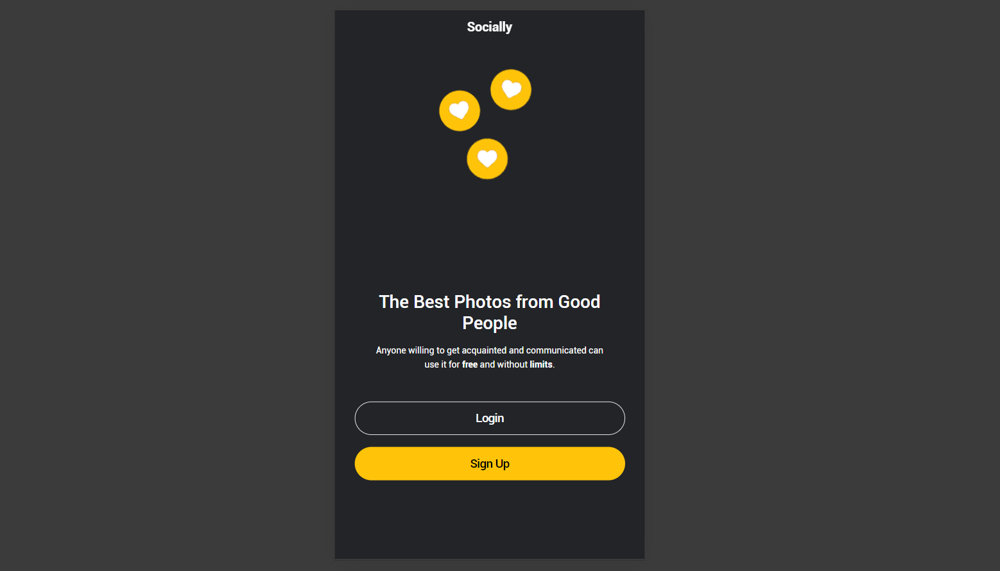
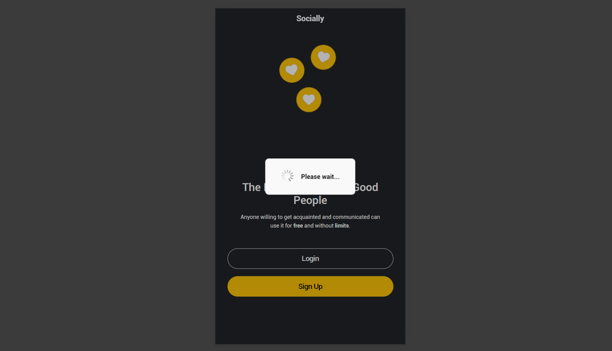

# Ionic Start
## Componentes usados
 > * ion-app
 > * ion-header
 > * ion-toolbar
 > * ion-title
 > * ion-content
 > * ion-grid
 > * ion-row 
 > * ion-col
 > * ion-text
 > * ion-button  
 > * ion-loading
## Resultado

